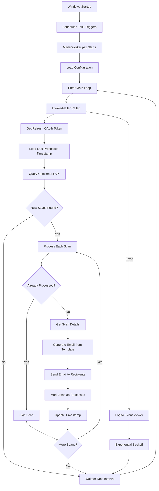

# CxMailer - Checkmarx ONE Post-Scan SMTP Notifier

[](https://github.com/PowerShell/PowerShell)
[](https://www.microsoft.com/windows)
[](LICENSE)

CxMailer is a Windows service that monitors Checkmarx ONE scans and automatically sends email notifications when scans complete. It runs as a scheduled task under the SYSTEM account and provides detailed scan results directly to stakeholders' inboxes.

## 🚀 Features

- **Automated Monitoring**: Continuously polls Checkmarx ONE API for completed scans
- **Email Notifications**: Sends HTML-formatted emails with scan results and risk scores
- **Secure Credential Storage**: Uses Windows DPAPI for machine-level encryption
- **Duplicate Prevention**: Tracks processed scans to avoid sending duplicate notifications
- **Robust Error Handling**: Implements exponential backoff and comprehensive logging
- **Easy Configuration**: Simple setup wizard for credentials and recipients
- **Windows Integration**: Runs as a Windows scheduled task with Event Log support

## 📊 How It Works



## 📋 Prerequisites

- Windows 10/11 or Windows Server 2016+
- PowerShell 5.1 or later
- Administrator privileges for installation
- SMTP server access (e.g., Gmail, Office 365)
- Checkmarx ONE API credentials (OAuth2 client ID and secret)

## 🔧 Installation

### 1. Clone the Repository

```powershell
git clone https://github.com/yourusername/cx-post-scan-smtp.git
cd cx-post-scan-smtp/post-scan-smtp
```

### 2. Configure Credentials and Settings

Run as Administrator:
```powershell
pwsh .\src\InstallConfiguration.ps1
```

This will prompt you for:
- SMTP server settings (server, port, username, password)
- Checkmarx ONE credentials (region, tenant, client ID, client secret)
- Email recipient addresses

### 3. Test Credential Access

Verify that the SYSTEM account can access the stored credentials:
```powershell
pwsh .\deploy\TestAsSystem.ps1
```

### 4. Install the Service

Create the scheduled task that runs at system startup:
```powershell
pwsh .\deploy\InstallTask.ps1
```

When prompted, choose 'y' to start the service immediately.

### 5. Verify Installation

Check that the service is running correctly:

1. **Event Viewer**: Windows Logs → Application → Filter by source "CxMailer"
2. **Service Log**: Check `logs\service.log` for activity
3. **Test Mode**: Run `pwsh .\src\MailerWorker.ps1 -TestMode`

## ⚙️ Configuration

### Configuration Files

- `config\config.json` - Main configuration (schedule, SMTP, Checkmarx settings)
- `config\recipients.txt` - Email recipient list (one per line)
- `logs\service.log` - Service activity log

### Sample Configuration

```json
{
  "scheduleInSeconds": 15,
  "smtp": {
    "server": "smtp.gmail.com",
    "port": "587",
    "from": "notifications@example.com"
  },
  "cxOne": {
    "region": "us",
    "tenant": "your-tenant"
  },
  "logging": {
    "eventLogSource": "CxMailer"
  }
}
```

## 📧 Email Notifications

The service sends HTML-formatted emails containing:
- Project name
- Scan status (Completed/Failed/Partial)
- Total risk score
- Detailed findings summary
- Timestamp of notification

## 🛠️ Management Commands

### Stop the Service
```powershell
Stop-ScheduledTask -TaskName CxMailer
```

### Start the Service
```powershell
Start-ScheduledTask -TaskName CxMailer
```

### Update Recipients
Edit `config\recipients.txt` (one email per line) - no service restart needed

### Update Credentials
```powershell
pwsh .\deploy\QuickConfig.ps1
```

### Uninstall the Service
```powershell
pwsh .\deploy\UninstallTask.ps1
```

### Complete Cleanup
```powershell
pwsh .\deploy\Cleanup.ps1
```

## 🔍 Troubleshooting

### "Secret not found" Errors

If you see credential errors in the Event Viewer:
1. Run `pwsh .\deploy\FixCredentials.ps1` as Administrator
2. This will reconfigure credentials for SYSTEM access

### Service Not Starting

1. Check Event Viewer for specific error messages
2. Verify network connectivity to Checkmarx ONE
3. Test manually: `pwsh .\src\MailerWorker.ps1 -TestMode`
4. Ensure all prerequisites are met

### Emails Not Being Sent

1. Verify SMTP settings (server, port, TLS/SSL)
2. Check firewall rules for SMTP port
3. For Gmail: use app-specific password, not regular password
4. Ensure `config\recipients.txt` contains valid email addresses
5. Check `logs\service.log` for SMTP errors

### API Connection Issues

1. Verify Checkmarx ONE credentials are correct
2. Check region setting matches your Checkmarx instance
3. Ensure OAuth2 client has necessary permissions
4. Test network access to Checkmarx API endpoints

## 🔒 Security Considerations

- **Credential Storage**: All credentials are encrypted using Windows DPAPI with machine-level protection
- **Machine Binding**: Encrypted credentials can only be decrypted on the same machine
- **SYSTEM Account**: Service runs under SYSTEM account with highest privileges
- **No Plain Text**: No credentials are stored in plain text
- **Audit Trail**: All operations are logged to Windows Event Log

## 📁 Project Structure

```
post-scan-smtp/
├── config/                 # Configuration files
│   ├── SecureConfig.psm1  # Credential encryption module
│   ├── config.json        # Main configuration
│   └── recipients.txt     # Email recipients
├── deploy/                # Deployment scripts
│   ├── InstallTask.ps1    # Service installation
│   ├── TestAsSystem.ps1   # SYSTEM account test
│   └── QuickConfig.ps1    # Quick reconfiguration
├── src/                   # Source code
│   ├── MailerCore.psm1    # Core functionality
│   ├── MailerWorker.ps1   # Main service loop
│   └── InstallConfiguration.ps1  # Setup wizard
├── templates/             # Email templates
│   └── notification_template.html
└── logs/                  # Service logs
```

This README provides:

1. **Clear Overview** - What the utility does and its key features
2. **Visual Flow** - The Mermaid flowchart showing how it works
3. **Step-by-Step Installation** - Easy to follow setup instructions
4. **Configuration Details** - How to customize the service
5. **Troubleshooting Guide** - Common issues and solutions
6. **Security Information** - How credentials are protected
7. **Project Structure** - Understanding the codebase layout
8. **Contributing Guidelines** - How others can help improve it

The README uses:
- Shields/badges for quick visual information
- Emoji for better readability
- Code blocks with syntax highlighting
- Mermaid diagram (GitHub renders this automatically)
- Clear section headers
- Professional formatting

You can customize the repository URL, license type, and other project-specific details as needed.

## 🤝 Contributing

1. Fork the repository
2. Create your feature branch (`git checkout -b feature/AmazingFeature`)
3. Commit your changes (`git commit -m 'Add some AmazingFeature'`)
4. Push to the branch (`git push origin feature/AmazingFeature`)
5. Open a Pull Request

### Development Guidelines

- Follow PowerShell best practices
- Add meaningful comments to complex logic
- Test with different Checkmarx ONE configurations
- Update documentation for new features

## 📝 License

This project is licensed under the MIT License - see the [LICENSE](LICENSE) file for details.

## 🙏 Acknowledgments

- Built for Checkmarx ONE integration
- Uses Windows Task Scheduler for reliability
- Leverages PowerShell's security features

## 📞 Support

For issues, questions, or contributions:
- Open an issue on GitHub
- Check existing issues before creating new ones
- Provide logs and error messages when reporting problems

---

**Note**: Remember to remove any sensitive information (credentials, server addresses) before sharing logs or configuration files.
